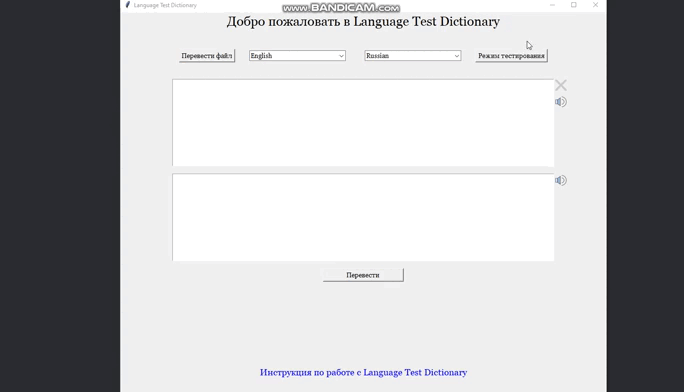

# Language Test Dictionary
___

This software was created to help users learn words in the language they are studying. :orange_book:

P.S. The "File Translation" and "Sentence Processing" functions have been left for future development. :pen: 

My goal was to create a project that would perform its primary functionality. Also, in the future, there is a possibility of changing the design of the application, but for now, we are content with what we have. :upside_down_face:

## Content

- [:man_technologist: Technologies](#Technologies)
- [:rocket: How to run](#How-to-run)
- [:white_check_mark: Testing](#Testing)
- [:page_with_curl: Logs](#Logs)
- [:scroll: Instruction for use](./app/other/instruction/instruction.pdf)

## Technologies

> All technologies and versions can also be seen in pyproject.toml

- [tkinter](https://docs.python.org/3/library/tkinter.html) - GUI library
- [tinydb](https://tinydb.readthedocs.io/en/latest/) - ORM for managing NoSQL databases
- [keyboard](https://pypi.org/project/keyboard/) - library for hotkeys
- [pyperclip](https://pypi.org/project/pyperclip/) - library for working with copy/paste hotkeys
- [python-docx](https://python-docx.readthedocs.io/en/latest/) - library for working with .doc and .docx files
- [pandas](https://pandas.pydata.org/) - used for working with .xlsx files
- [googletrans](https://pypi.org/project/googletrans/) - library for translating
- [gtts](https://pypi.org/project/gTTS/) - library for speech synthesis
- [pygame](https://www.pygame.org/news) - used for playing speech synthesis
- [openpyxl](https://openpyxl.readthedocs.io/en/stable/) - additional library for working with .xlsx files
- [pytest](https://docs.pytest.org/en/8.0.x/) - library for testing the app.

## How to run

The project was developed with **Python ^3.12**, so you can use the same version or try any other at your own responsibility.

- Install Poetry (I used **version 1.8.2**): `pip install poetry`
- Run command `poetry install` to install requirements for your project from _pyproject.toml_
- Run command `python LanguageTestDictionary.py`

## Testing

- To run all tests, use the command `pytest`
- To run test cases in a specific file, use the command `pytest ./path/to/test_directory/test_module.py`
- To run a specific test, use the command `pytest ./path/to/test_directory/test_module.py::TestClass::test_method`

## Logs

You can find .log files with information about the program's operation after you've used it.
- All log files will be saved in the directory: **_./app/other/logs/_**
